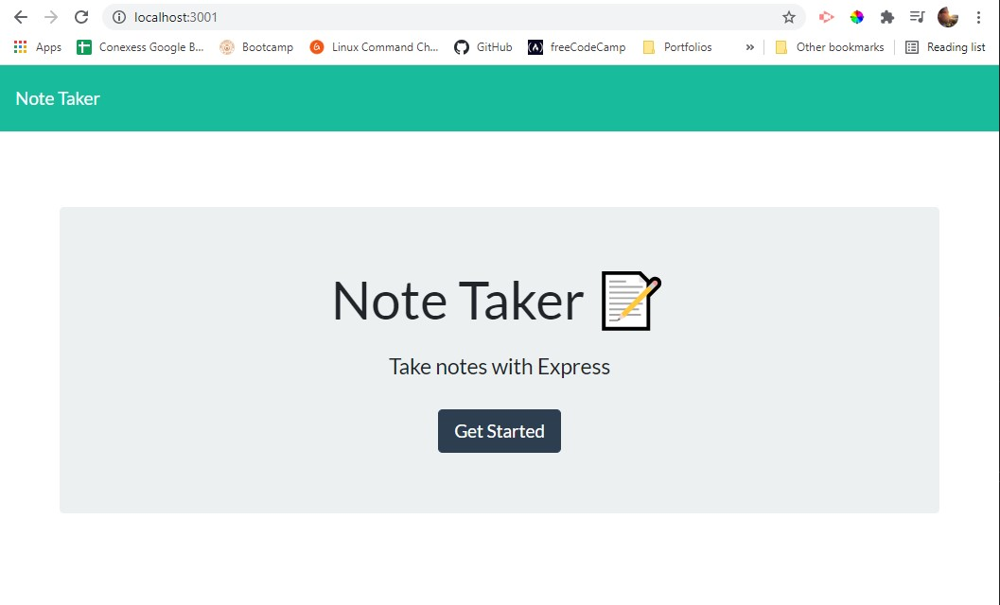
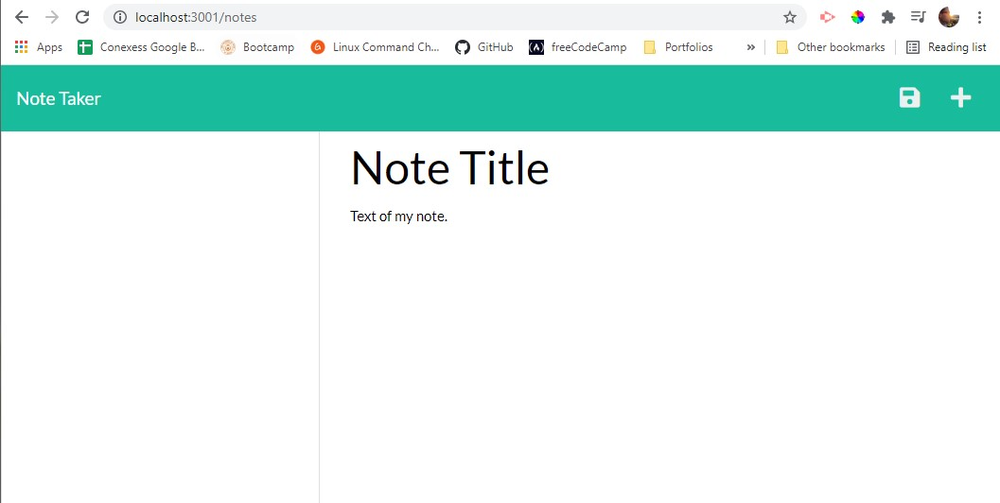

# Challenge 11 - Note Taker Application

## Purpose
As a small business owner, I want to be able to write and save notes to help organize and keep track of my tasks.

## Built With
* HTML/CSS Starter Code 
* JavaScript
* Inquirer
* JSON
* Node
* API Routes
* Express.js

## Requirements/Notes
* AS A small business owner
* I WANT to be able to write and save notes
* SO THAT I can organize my thoughts and keep track of tasks I need to complete

## Live URL
https://christenson10.github.io/Challenge11/
## Github Link
https://github.com/christenson10/Challenge11.git

## Heroku Link
https://enigmatic-brushlands-92319.herokuapp.com/

## Pictures

## README Preview 1
localhost:3001 takes to Note Taker

## README Preview 2
localhost:3001/notes takes you to text boxes

